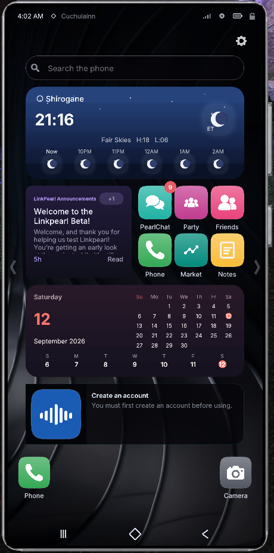

# Linkpearl

**The Next Generation of In-Game Connectivity**

  

Linkpearl is a community-driven, immersive in-game smartphone experience built for **Final Fantasy XIV**.

Inspired by the linkpearls of Eorzea, Linkpearl reimagines how an adventurer might carry a modern communication device within the world of FFXIV. It combines familiar smartphone functionality with an interface designed to feel at home alongside the fantasy, technological, and social elements of XIV.

Rather than simply recreating a real-world phone inside the game, Linkpearl is being built as an expandable platform for **communication, social interaction, music, venues, community tools, customization, and entertainment**.

## More Than a Phone

Linkpearl brings multiple connected experiences together inside a single customizable device.

Features include:

- **PEARLCHAT** — Instant messaging and communication between Linkpearl users.
- **VYBE** — A social platform for profiles, posts, communities, discovery, galleries, hashtags, follows, likes, comments, and more.
- **Music** — Tools designed around FFXIV's DJ, venue, and listener communities, including profiles, stations, events, and live broadcasting features.
- **Phone & Contacts** — Manage contacts and interact with other Linkpearl users through a familiar phone-style interface.
- **Pearls** — Linkpearl's earnable in-app currency used for cosmetics and customization. Pearls are earned through using Linkpearl and are **not sold for real-world money**.
- **Weather & World Information** — Quickly view useful information from directly within the device.
- **Utilities** — Everyday tools including alarms, timers, stopwatch, calculator, clock, notes, and more.
- **Customization** — Personalize your Linkpearl with cases, themes, badges, cosmetics, and other unlockable options.
- **Profiles & Social Identity** — Create a recognizable identity across the Linkpearl ecosystem with your character, title, job, badges, interests, and social features.
- **Games & Entertainment** — Additional interactive experiences are planned as Linkpearl continues to grow.

## Built for the FFXIV Community

Linkpearl is designed around the way the FFXIV community actually plays.

Whether you're roleplaying with friends, running a venue, performing as a DJ, meeting new people, sharing screenshots, organizing events, or simply looking for another layer of immersion, Linkpearl aims to provide one connected space for it.

The project combines the convenience of a modern smartphone with an aesthetic designed specifically for Final Fantasy XIV — blending **fantasy, Sharlayan-inspired elegance, Allagan technology, and modern interface design**.

Linkpearl is actively evolving, and new applications, integrations, customization options, social features, and community tools will continue to be introduced as development progresses.

**Welcome to Linkpearl.**

The Next Generation of In-Game Connectivity.

## Install

Either custom-repo URL installs the same testers plugin (**Linkpearl**, internal name `LinkpearlDev`):

https://raw.githubusercontent.com/Pearlgate-XIV/Linkpearl/master/linkpearl.json

https://pearlgate.194.113.211.29.sslip.io/plugin/pluginmaster.json

`pluginmaster.json` on GitHub and `linkpearl.json` on Pearlgate are copies of those two. Enable **one** URL, save, then `/xlplugins` → install **Linkpearl**. Dalamud only offers updates from the URL you installed from; switch URL by uninstalling first.
